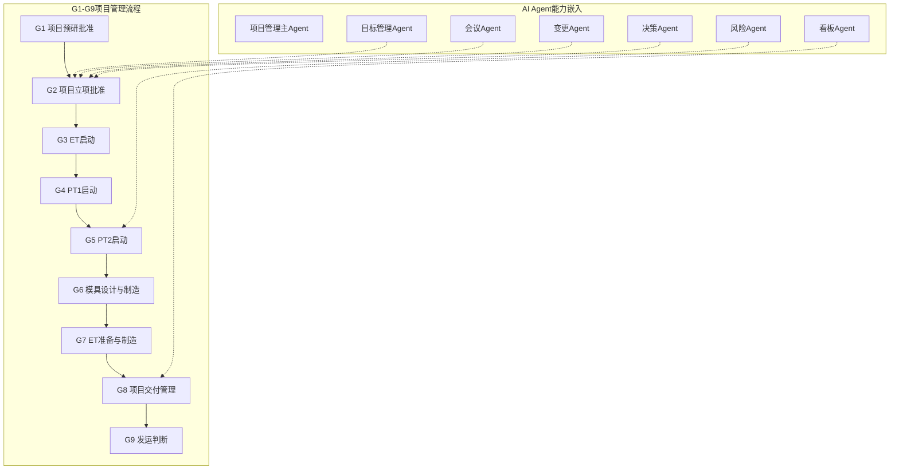

# 项目管理AI架构业务Map

## 核心内容

### G1-G9项目管理全流程

| 阶段 | 活动 | AI Agent嵌入 |
|------|------|-------------|
| G1 项目预研批准 | 产品定位与定义、商业论证 | 产品Agent |
| G2 项目立项批准 | 计划管理、风险管理、成本管理 | 目标管理Agent、会议Agent、决策Agent |
| G3 ET启动 | 数据设计与发布 | 数据发布Agent |
| G4 PT1启动 | PT准备与制造、PT测试 | 交付Agent |
| G5 PT2启动 | 设计方案批准、质量问题解决 | 风险Agent、专业级Agent |
| G6 模具设计与制造 | 骡子车测试与验证 | 造型Agent |
| G7 ET准备与制造 | ET质量问题解决 | 风险Agent |
| G8 项目交付管理 | 项目运营管理 | 项目PM Agent、看板Agent |
| G9 发运判断 | SOP启动 | 采购Agent |

### 两大AI业务流程（来自原画板）

#### 目标管理Agent
```
目标对齐 → 专业目标设定 → 提案审批 → 进度数据采集 → 数据分析与风险识别 → 经验总结 → 知识库
```
AI渗透率：33%-100%

#### 会议管理Agent
```
会议信息确认 → 时段推荐 → 参会人识别 → 会议室预约 → 会议纪要生成 → 待办确认
```
AI渗透率：50%-100%

### Agent框架（来自scope3）

| Agent | 职责 |
|-------|------|
| 项目管理主Agent | 总体协调 |
| 目标管理Agent | 目标设定与对齐 |
| 会议Agent | 会议预约与纪要 |
| 风险Agent | 风险识别与预警 |
| 变更Agent | 变更管理 |
| 成本Agent | 成本管理 |
| 计划Agent | 计划调度 |
| 交付Agent | 交付管理 |
| 采购Agent | 采购管理 |
| 看板Agent | 数据可视化 |

## Mermaid代码



## 图例

- 绿色：100% AI完成
- 橙色：AI+人工完成
- 紫色：纯人工完成
- 虚线：AI Agent嵌入